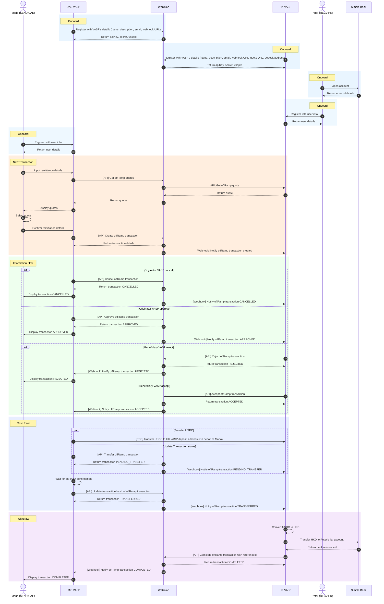

# User Flow Overview

Illustrates the end-to-end transaction process between the **Originator** and the **Beneficiary**, highlighting the interactions and state transitions.

### Sequence Diagram

# Transaction Overview

Outlines the lifecycle of a transaction between the **Originator VASP** and the **Beneficiary VASP**.

### Transaction Lifecycle Diagram

```mermaid
flowchart LR
    subgraph Background[ ]
        subgraph Legend[ ]
            direction LR
            API[api endpoint]
            STATUS((STATUS))
        end
        
        subgraph Main[ ]
            direction LR
            START(( )) --> CREATE[create tx] --> NEW((NEW))
            NEW --> APPROVE[approve tx] --> APPROVED((APPROVED))
            NEW --> CANCEL[cancel tx] --> CANCELLED((CANCELLED))
            APPROVED --> ACCEPT[accept tx] --> ACCEPTED((ACCEPTED))
            APPROVED --> REJECT[reject tx] --> REJECTED((REJECTED))
            ACCEPTED --> TRANSFER[transfer tx] --> PENDING_TRANSFER((PENDING_TRANSFER))
            PENDING_TRANSFER --> UPDATE[update tx-hash] --> TRANSFERRED((TRANSFERRED))
            TRANSFERRED --> COMPLETE[complete tx] --> COMPLETED((COMPLETED))
        end
    end

    %% Styles
    style Background fill:#f5f5f5,stroke:#ccc
    style Main fill:transparent,stroke:transparent
    style Legend fill:#ffffff,stroke:#999,stroke-dasharray:5 5
    style API fill:#cce5ff,stroke:#333
    style STATUS fill:#ffffcc,stroke:#333
    style CREATE fill:#cce5ff,stroke:#333
    style APPROVE fill:#cce5ff,stroke:#333
    style CANCEL fill:#cce5ff,stroke:#333
    style ACCEPT fill:#cce5ff,stroke:#333
    style REJECT fill:#cce5ff,stroke:#333
    style TRANSFER fill:#cce5ff,stroke:#333
    style UPDATE fill:#cce5ff,stroke:#333
    style COMPLETE fill:#cce5ff,stroke:#333
    style NEW fill:#ffffcc,stroke:#333
    style APPROVED fill:#ffffcc,stroke:#333
    style ACCEPTED fill:#ffffcc,stroke:#333
    style PENDING_TRANSFER fill:#ffffcc,stroke:#333
    style TRANSFERRED fill:#ffffcc,stroke:#333
    style COMPLETED fill:#ccffcc,stroke:#333
    style CANCELLED fill:#ffcccc,stroke:#333
    style REJECTED fill:#ffcccc,stroke:#333
```

### Flow Breakdown

1. **Create Transaction**
   - Status: `NEW`
   - Initiated by **Originator VASP**

2. **Approve Transaction**
   - Status: `APPROVED`
   - Confirmed by **Originator VASP**

3. **Cancel Transaction**
   - Status: `CANCELLED`
   - Cancelled by **Originator VASP**

4. **Accept Transaction**
   - Status: `ACCEPTED`
   - Accepted by **Beneficiary VASP**

5. **Reject Transaction**
   - Status: `REJECTED`
   - Rejected by **Beneficiary VASP**

6. **Transfer Transaction**
   - Status: `PENDING_TRANSFER`
   - On-chain transfer initiated by **Originator VASP**

7. **Update Transaction Hash**
   - Status: `TRANSFERRED`
   - Transaction hash submitted by **Originator VASP**

8. **Complete Transaction**
   - Status: `COMPLETED`
   - Finalized by **Beneficiary VASP**
